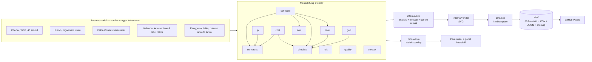

# Control Tower MPPL

**Ruang kendali kuantitatif untuk proyek perangkat lunak, ditulis dalam Go.**
Satu basis kode yang sama merender situs statis di server *dan* berjalan di peramban lewat WebAssembly.

[](https://github.com/xyb3rpunq/mppl-control-tower/actions/workflows/ci.yml)
[](https://github.com/xyb3rpunq/mppl-control-tower/actions/workflows/pages.yml)

| | |
| --- | --- |
| **Situs live** | https://xyb3rpunq.github.io/mppl-control-tower/ |
| **Bahasa Inggris** | https://xyb3rpunq.github.io/mppl-control-tower/en/ |
| **Mata kuliah** | Manajemen Proyek Perangkat Lunak — Universitas Esa Unggul |
| **Proyek yang dianalisis** | Sistem Informasi Alumni & Tracer Study STIE Jayakusuma |
| **Studi kasus nasional** | Coretax DJP (Rp 1,34 triliun) |

---

## Daftar isi

1. [Masalah yang dipecahkan](#1-masalah-yang-dipecahkan)
2. [Temuan utama](#2-temuan-utama)
3. [Peta situs: 15 halaman × 2 bahasa](#3-peta-situs-15-halaman--2-bahasa)
4. [Mesin hitung](#4-mesin-hitung)
5. [Referensi 38 rumus](#5-referensi-38-rumus)
6. [Bedah kasus Coretax](#6-bedah-kasus-coretax)
7. [Interaktivitas lewat WebAssembly](#7-interaktivitas-lewat-webassembly)
8. [Data terbuka](#8-data-terbuka)
9. [Arsitektur](#9-arsitektur)
10. [Menjalankan secara lokal](#10-menjalankan-secara-lokal)
11. [Pengujian](#11-pengujian)
12. [CI/CD](#12-cicd)
13. [Asumsi, celah yang ditutup, dan batas yang tersisa](#13-asumsi-celah-yang-ditutup-dan-batas-yang-tersisa)
14. [Sumber data](#14-sumber-data)

---

## 1. Masalah yang dipecahkan

Proyek perangkat lunak di Indonesia rutin gagal pada jadwal dan biaya, dan nyaris tidak ada yang menjalankan hitungan yang sebenarnya sudah bisa memperingatkan sejak awal. Perkakas yang mampu melakukannya — MS Project, Primavera — berbayar, tertutup, dan tidak berbahasa Indonesia.

Aplikasi ini menjalankan seluruh hitungan itu sebagai kode Go yang terbuka dan teruji:

- **Penjadwalan** — CPM empat relasi PDM, PERT, GERT, penjadwalan berbatas sumber daya yang **terbukti optimal lewat batas bawah**, crashing **eksak dengan pemrograman linear**, fast-tracking
- **Ketidakpastian** — Monte Carlo 10.000 iterasi lima lapis: korelasi antar-aktivitas, risiko yang bergerombol, putaran rework, dan kapasitas nyata
- **Biaya** — Earned Value lengkap sampai Earned Schedule, biaya sewa yang bergantung waktu, struktur anggaran berlapis, Joint Confidence Level
- **Pengendalian** — prakiraan berjalan dari tanggal data yang belajar dari realisasi lewat kredibilitas Bühlmann
- **Risiko** — Expected Monetary Value inheren dan residual, uji kecukupan cadangan
- **Mutu** — Seven Basic Tools of Quality beserta aturan keputusannya

Lalu membuktikannya pada satu kasus nyata berskala nasional: **proyek Coretax DJP** senilai Rp 1,34 triliun, yang diluncurkan serentak untuk seluruh wajib pajak Indonesia pada 1 Januari 2025 dan dalam bulan pertama menurunkan penerimaan perpajakan sebesar 34,5%. Pola kegagalannya identik dengan proyek kuliah Rp 14,8 juta yang dianalisis situs ini — hanya skalanya yang berbeda sekitar sembilan puluh ribu kali.

---

## 2. Temuan utama

Semua temuan **diturunkan dari angka, bukan ditulis tetap**. Setiap temuan menyebut metrik pemicunya, dan kalau datanya diperbaiki, temuannya ikut hilang dengan sendirinya.

| # | Keparahan | Temuan | Angka |
| --- | --- | --- | --- |
| 1 | kritis | Proyeksi biaya akhir melewati pagu | EAC Rp 16.157.314 vs pagu Rp 16.000.000 (CPI 0,918) |
| 2 | kritis | Cadangan kontinjensi jauh di bawah paparan risiko | Cadangan Rp 500.000 menutup 17,4% dari EMV residual Rp 2.880.000 |
| 3 | kritis | Komitmen 17 minggu nyaris mustahil | Peluang selesai ≤ 85 hari kerja: 1,2%; P80 = 98 hari kerja |
| 4 | kritis | Jadwal 85 hari hanya sah di atas kertas | Jadwal levelling optimal: **113 hari kerja**, selesai 10 April 2026 (+15 dari kapasitas, +13 dari UTS & UAS) |
| 5 | kritis | Peluang tepat waktu *dan* tepat anggaran nyaris nol | JCL pada target piagam: 0,0%; komitmen JCL 70% = **147 hari kerja (5 Juni 2026) & Rp 23.681.409** |
| 6 | kritis | Dari tanggal data, P80 penyelesaian jauh melampaui prakiraan Earned Value | Prakiraan berjalan P80 **125 hari kerja** (28 April 2026) vs IEAC(t) 91,0 hari; komitmen JCL 70% berjalan 121 hari & Rp 21.819.542 |
| 7 | tinggi | Satu orang dijadwalkan pada dua pekerjaan sekaligus | 26 hari-peran over-alokasi; peran kritis: Backend Developer |
| 8 | tinggi | Waktu respons bergeser sistematis | 10 pelanggaran aturan Nelson walau semua nilai di bawah spesifikasi 3 detik |
| 9 | tinggi | Proyek tertinggal dalam satuan waktu | Earned Schedule: SV(t) = −2,90 hari kerja |
| 10 | sedang | Biaya kegagalan melebihi biaya pencegahan | Rasio kesesuaian/ketidaksesuaian 0,69 |
| 11 | sedang | Mengabaikan korelasi menyembunyikan ketidakpastian | Simpangan baku durasi melebar 23,1% dengan ρ = 0,5 |
| 12 | sedang | Risiko yang berbagi sebab menebalkan ekor biaya | Rerata tetap Rp 19,18 jt; P95 biaya naik dari Rp 22,79 jt ke Rp 23,23 jt |
| 13 | sedang | Pemeriksaan bisa gagal berulang (GERT) | Tambahan harapan 1,52 hari kerja dan Rp 121.690; P(regresi butuh ≥ 2 putaran tambahan) = 9% |
| 14 | sedang | Realisasi selama UTS membantah asumsi kapasitas ujian 40% | Laju saat UTS 103,5% dari normal; kredibilitas empiris 98,1%, faktor ujian diperbarui menjadi 98,8% |
| 15 | baik | Jadwal levelling terbukti tidak bisa diperpendek dengan mengubah urutan | Jadwal terbaik 113 = batas bawah 113; aturan LST lama memberi 114 |
| 16 | baik | Lima hari percepatan pertama hampir dibayar sendiri | Premi lembur PP 35/2021 Rp 195.000, biaya bersih setelah sewa hanya **Rp 44.789** (sewa menutup 77%) |

Temuan tambahan dari halaman Piagam dan pencocokan kalender resmi: **tanggal selesai di Project Charter salah enam hari kerja.** Tujuh belas minggu kalender polos berakhir 13 Februari 2026; 85 hari kerja sesungguhnya berakhir **23 Februari 2026** setelah akhir pekan, empat libur nasional, dan dua cuti bersama dikeluarkan. Pencocokan dengan SKB 3 Menteri menemukan cuti bersama Imlek 16 Februari 2026 yang sebelumnya tidak ada di model.

Temuan yang tidak terlihat dari SPI: rasio durasi aktual terhadap rerata PERT pada 16 aktivitas yang sudah selesai adalah **0,983** — penyimpangan itu masih di dalam derau estimasi beta-PERT (sd 4,2%), sehingga kredibilitas empirisnya nol: tidak ada bukti tim lebih lambat dari sebaran estimasinya. SPI 0,915 lahir dari jadwal yang disusun memakai M (paling mungkin), bukan dari kinerja buruk.

---

## 3. Peta situs: 15 halaman × 2 bahasa

Setiap halaman tersedia dalam bahasa Indonesia (akar situs) dan bahasa Inggris (`/en/…`), dengan tautan `hreflang` yang saling menunjuk. Total 30 halaman.

### 3.1 Ruang Kendali — `/`

- **Delapan KPI** dengan warna status: SPI, CPI, EAC, peluang tepat waktu, cakupan cadangan risiko, durasi yang bisa dijalankan (dengan status terbukti optimal), JCL, dan P80 prakiraan berjalan (dengan SV(t) dan IEAC(t)).
- **Kurva-S Earned Value**: PV, EV, AC, proyeksi biaya sampai akhir (mengikuti bentuk sisa kurva PV, bukan garis lurus), garis BAC, dan garis tanggal data.
- **Enam belas temuan** diturunkan dari ambang, masing-masing dengan metrik pemicu, rekomendasi, dan tautan ke halaman perhitungannya.
- Ringkasan jadwal (termasuk selisih akibat hari libur) dan ringkasan anggaran berlapis.

### 3.2 Piagam & Lingkup — `/piagam/`

- Project Charter terstruktur: informasi umum, tujuan, lingkup masuk dan keluar, deliverable, asumsi, batasan.
- **Catatan pemeriksaan** yang membuktikan tanggal selesai piagam tidak konsisten dengan kalender kerja, lengkap dengan tabel libur nasional dan cuti bersama beserta dasar hukumnya (SKB 3 Menteri 2025 dan 2026).
- Kriteria keberhasilan dengan status menurut data (anggaran dan jadwal terancam; sisanya belum terukur sebelum go-live).
- **Work Breakdown Structure** 5 fase → 15 paket kerja → 35 aktivitas + 5 milestone, dengan estimasi tiga titik, anggaran, float, dan pendahulu per aktivitas.
- **Pemeriksaan aturan 100%** secara aritmetis (jumlah anggaran aktivitas = BAC).
- **Rekonsiliasi anggaran**: grafik air terjun BAC → cadangan kontinjensi → cadangan manajemen → pagu Rp 16 juta, plus tabel tarif harian per peran.

### 3.3 Jadwal & Jalur Kritis — `/jadwal/`

- **Gantt chart** dengan batang jalur kritis, batang float (bayangan), batang realisasi (hijau/jingga bila melampaui rencana), penanda milestone, panah ketergantungan jalur kritis, dan garis tanggal data.
- **Diagram jaringan Activity-on-Node** dengan tata letak berlapis menurut early start; setiap simpul memuat ES, durasi, EF, LS, total float, LF.
- **Tabel CPM lengkap** 40 simpul: d, ES, EF, LS, LF, TF, FF, tanggal mulai/selesai, pendahulu.
- Rantai jalur kritis tersambung (29 simpul) dan tabel aktivitas ber-float terbesar beserta maknanya.

### 3.4 Levelling & Kompresi — `/optimasi/`

- **Levelling sumber daya yang terbukti optimal**: CPM 85 → kapasitas nyata 100 → UTS dan UAS 113 hari kerja, selesai 10 April 2026.
- **Bukti optimalitas**: enam aturan prioritas (LST, LFT, MSLK, GRPW, MTS, SPT), 300 daftar acak berbias, dan justifikasi maju-mundur mencari batas atas; batas bawah tiga lapis (CPM 85, solo 108, energetik 113) plus pembuktian destruktif. Batas atas = batas bawah = 113, jadi tidak ada urutan kerja yang bisa selesai lebih cepat.
- **Levelling eksak di dalam simulasi**: **10.000 dari 10.000** iterasi lapisan kapasitas terbukti optimal — 8.077 langsung oleh SGS cepat (sama dengan batas bawahnya), 1.923 setelah `level.Search`, yang rata-rata menghemat 0,38 hari per iterasi dan paling banyak 10 hari. Hal yang sama berlaku untuk seluruh iterasi prakiraan berjalan.
- **Kalender ketersediaan**: keempat periode ujian dari lampiran kalender akademik resmi Esa Unggul (SK Rektor No. 039/SK-R/UEU/III/2025) — UTS ganjil 3–15 Nov 2025, UAS ganjil 19–31 Jan 2026, UTS genap 18–30 Mei 2026, UAS genap 20 Jul–1 Agu 2026; DevOps paruh waktu (dari piagam).
- **Gantt pembanding** CPM vs levelling, batang diwarnai menurut penyebab, jendela ujian diarsir.
- **Histogram pembebanan setelah levelling** dengan garis kapasitas bertangga per hari — nol over-alokasi.
- Hari menunggu per peran dan **peran kritis** (Backend Developer).
- **Premi lembur dari PP 35/2021**, bukan asumsi: pekerjaan hari yang dipotong dibagi rata sebagai lembur ke hari tersisa; jam pertama 1,5×, jam berikutnya 2× upah sejam (1/173 upah sebulan), paling lama 4 jam sehari dan 18 jam seminggu. Premi per aktivitas 75%–87,5%; **lima aktivitas dua hari (A27, A29, A31, A34, A36) tidak boleh dipotong** karena butuh 8 jam lembur dalam sehari.
- **Crashing serakah vs eksak**: kurva 85 → 68 hari; LP simpleks membuktikan serakah **tidak optimal** (kelebihan sampai Rp 4.063).
- **Time-cost trade-off**: LP biaya total (premi lembur + sewa server & langganan Rp 44.740/hari). Lima hari pertama berpremi Rp 195.000 tetapi biaya bersihnya hanya Rp 44.789; dengan premi sesuai aturan, tidak ada durasi yang lebih murah dari 85 hari. Grafik tiga kurva (crash eksak, sewa, total) dengan titik biaya terendah.
- **Fast-tracking**: 23 kandidat diuji dengan tumpang tindih 50%; kandidat orang-sama **ditolak**; 11 kandidat layak; penerapan serentak memberi 66 hari.

### 3.5 PERT & Monte Carlo — `/pert/`

- Perbandingan PERT (Z-score jalur kritis) dan Monte Carlo 10.000 iterasi berdampingan.
- Penjelasan **merge bias**: mengapa rerata simulasi 94,3 hari, bukan 85.
- Histogram durasi dengan kurva kumulatif dan penanda rencana, P50, P80, P90.
- Tabel tingkat keyakinan P50–P95 beserta tanggal selesai dan kelayakan untuk dijanjikan.
- **Diagram tornado** sensitivitas (korelasi peringkat Spearman) dan porsi iterasi kritis per aktivitas.
- Tabel estimasi tiga titik: O, M, P, te, σ, varians, dan kecondongan.
- **Panel WebAssembly**: jalankan ulang Monte Carlo dengan iterasi, benih, dan sebaran (beta-PERT/segitiga) pilihan.

### 3.6 Simulasi Terpadu & JCL — `/simulasi-terpadu/`

- **Lima lapisan realisme** dengan benih yang sama sehingga selisihnya murni efek yang ditambahkan:

  | Lapisan | Efek | P80 durasi | P80 biaya | JCL |
  | --- | --- | --- | --- | --- |
  | L0 | Independen (identik dengan halaman PERT) | 98 | Rp 16,23 jt | 1,17% |
  | L1 | + Korelasi peran (kopula Gauss, ρ 0,5) | 99 | Rp 16,34 jt | 3,45% |
  | L2 | + Risiko bergerombol (kopula faktor, λ 0,6) | 117 | Rp 20,94 jt | 0,45% |
  | L3 | + Putaran rework GERT | 119 | Rp 21,18 jt | 0,31% |
  | L4 | + Kapasitas, UTS & UAS (levelling eksak per iterasi) | 151 | Rp 22,02 jt | 0,00% |

  Biaya di setiap lapisan sudah memuat sewa server dan langganan yang ikut memanjang bersama jadwal.
- **Tangga realisme** durasi dan biaya (P50–P90 dengan penanda P80 dan garis target piagam).
- **Peta kepadatan JCL** dengan **frontier JCL 70%**, silang target piagam, titik P80 × P80; tabel frontier dan histogram biaya akhir.
- **Uji kepekaan ρ** (0; 0,25; 0,5; 0,75) dengan korelasi terealisasi.
- **Risiko bergerombol**: lima penggerak bersama yang dibaca dari kolom penyebab register; penggerak kinerja pengembang memakai faktor laten Backend Developer yang sama dengan durasi aktivitasnya. Uji kepekaan λ (0; 0,3; 0,6; 0,9): rerata biaya tetap, phi terealisasi naik, P95 biaya menebal; grafik sebaran jumlah risiko per proyek.
- **Putaran rework GERT**: dua pemeriksaan yang bisa gagal berulang (regresi pasca perbaikan bug p = 30%, uji penetrasi p = 25%) direduksi dengan aturan Mason; rerata putaran analitik 0,429 dan 0,333 cocok dengan Monte Carlo 0,445 dan 0,330.
- **Biaya yang bergantung waktu**: empat pos sewa dan langganan dengan tarif harian dari rentang rencana.
- Frekuensi kejadian setiap risiko beserta penggeraknya.
- **Panel WebAssembly**: geser ρ, pilih lapisan L0–L4, jalankan simulasi terpadu di peramban.

### 3.7 Biaya & Earned Value — `/biaya/`

- KPI PV, EV, AC, BAC.
- **Tabel seluruh metrik turunan** dengan rumus dan kalimat cara membaca: SV, CV, SPI, CPI, ES, SV(t), SPI(t), tiga varian EAC, ETC, VAC, TCPI.
- **Panel WebAssembly** untuk menggeser tanggal data (dibatasi pada hari terakhir yang punya realisasi, agar SPI yang anjlok karena kehabisan data tidak terbaca sebagai temuan).
- Kurva-S, grafik anggaran berlapis, dan catatan bahwa proyeksi menembus seluruh cadangan.
- Earned Value per fase dan per aktivitas (% rencana, % aktual, EV, AC, CV, status).

### 3.8 Prakiraan Berjalan — `/prakiraan/` *(baru)*

- **Simulasi terpadu dari tanggal data** (19 Des 2025): 18 simpul selesai dikunci pada realisasinya, 3 aktivitas yang sedang berjalan (A17, A19, A21) memakai durasi bersyarat F(x | x > e), 19 sisanya dirilis pada tanggal data.
- **Lima prakiraan berdampingan**: rencana CPM 85; Earned Value IEAC(t) 91,0 & EAC Rp 16,16 jt; simulasi perencanaan P80 151; prakiraan berjalan tanpa belajar P80 129; **prakiraan berjalan terkalibrasi P80 125 & Rp 20,83 jt** — dengan kolom "buta terhadap" untuk tiap metode.
- **Kredibilitas Bühlmann empiris** — bobot tidak dipilih, tetapi diestimasi dengan metode momen: Var = derau estimasi, tau² = max(0, selisih² − Var), Z = tau² / (tau² + Var).
  - Durasi: rasio aktual/rerata PERT 0,983, derau sd 4,2% → tau² = 0, **Z = 0**, faktor 1.
  - Biaya tenaga kerja harian: rasio 1,057, derau sd 2,2% (estimator sandwich) → **Z = 85,1%**, faktor 1,049.
  - Kapasitas ujian: teramati 103,5% (dibatasi 100%), derau dari metode delta → **Z = 98,1%**.
- **Kalibrasi kapasitas ujian** dari realisasi selama UTS resmi: laju 103,5% dari normal, faktor untuk UAS diperbarui 40% → 98,8%.
- Tabel bukti per aktivitas selesai, durasi bersyarat aktivitas yang sedang berjalan, status risiko pada tanggal data (risiko berstatus "terjadi" ditutup; risiko terbuka dipindah ke pekerjaan yang belum selesai), dan frontier JCL 70% dari tanggal data (121 hari & Rp 21.819.542).
- **Panel WebAssembly**: pilih tanggal data lain dan prakirakan ulang — kalibrasi dihitung dari bukti yang tersedia saat itu.

### 3.9 Manajemen Risiko — `/risiko/`

- KPI EMV inheren, EMV residual, cadangan tersedia, kekurangan cadangan dan paparan jadwal.
- **Dua peta panas 5×5** — sebelum dan sesudah mitigasi.
- **Risk register 12 entri**, masing-masing dengan kategori, pemilik, WBS terpapar, sebab, akibat, peluang/dampak/EMV/skor inheren dan residual, persentase penurunan EMV, strategi respons, mitigasi, dan pemicu.
- Paparan per kategori dan rekomendasi soal kecukupan cadangan.

### 3.10 Organisasi & Sumber Daya — `/organisasi/`

- **Bagan organisasi** lima tingkat (sponsor → PM → core lead → tim pelaksana) dan kartu tanggung jawab tiap peran.
- **Matriks RACI** per fase WBS yang divalidasi uji (tepat satu A per baris).
- **Histogram pembebanan** 10 peran sepanjang 85 hari kerja dengan batang over-alokasi merah, tabel utilisasi, dan daftar bentrokan terberat.
- **Grid kuasa-kepentingan** 10 pemangku kepentingan dan **rencana komunikasi** enam jalur.

### 3.11 Manajemen Mutu — `/kualitas/`

- **Tujuh metrik mutu** terukur terhadap target standar Project Charter.
- **Peta kendali X-bar** waktu respons: CL, UCL, LCL (metode A2·R̄), batas spesifikasi, σ proses, Cpk, dan penanda pelanggaran **empat aturan Nelson**.
- **Diagram Pareto** cacat berbobot keparahan (kritis 5, mayor 3, minor 1) per modul.
- **Dua diagram fishbone** (6M) dengan akar penyebab.
- **Biaya kualitas** empat kategori, rincian pos (terjadi vs proyeksi), dan rasio kesesuaian/ketidaksesuaian.

### 3.12 Bedah Kasus: Coretax — `/coretax/`

Lihat [bagian 6](#6-bedah-kasus-coretax).

### 3.13 Referensi Rumus — `/rumus/`

38 rumus dalam sembilan kelompok. Setiap rumus memuat notasi (dwibahasa), arti tiap simbol, makna, cara membaca, **jebakan umum**, rujukan materi, dan **contoh hitung yang disuntik dari angka hidup** — jadi halaman rumus tidak pernah bisa berbeda dari halaman analisisnya. Lihat [bagian 5](#5-referensi-38-rumus).

### 3.14 Materi & Area Pengetahuan — `/materi/`

- **Sembilan area pengetahuan** (Modul 2) dengan tautan ke artefak yang membuktikan area itu benar-benar dikerjakan, plus catatan area kesepuluh PMBOK 5.
- **Empat tahap siklus hidup** (Tugas 3) dipetakan ke fase WBS.
- **Peta materi kuliah → paket kode** yang mengimplementasikannya, termasuk GERT ("loop tes yang harus diulang") dan pengawasan jadwal dari Modul 4.
- Daftar dokumen sumber di folder mata kuliah, termasuk satu berkas yang tidak terkait (dokumen Oracle OLVM).

### 3.15 Metode & Sumber — `/metode/`

Arsitektur paket, keputusan teknis, **tabel asumsi** (alasan dan akibatnya bila keliru), **celah yang sudah ditutup** beserta buktinya, **batas yang tersisa**, dan tautan data terbuka.

---

## 4. Mesin hitung

Seluruh perhitungan berada di `internal/` sebagai paket Go murni **tanpa satu pun dependensi pihak ketiga**.

### `workcal` — kalender kerja
Pemetaan dua arah indeks hari kerja ↔ tanggal, seluruh libur nasional dan cuti bersama sampai akhir 2026 dengan dasar hukum SKB 3 Menteri, indeks pecahan untuk tanggal data yang jatuh di akhir pekan, dan daftar libur di dalam rentang.

### `schedule` — CPM dan PERT
- Urutan topologis dengan deteksi siklus, predecessor tak dikenal, dan kode ganda.
- Forward pass dan backward pass untuk **FS, SS, FF, SF** dengan lag dan lead, serta tanggal rilis (*start no earlier than*) untuk prakiraan berjalan.
- Total float, free float, dan **rantai kritis tersambung** (bukan sekadar filter float nol).
- PERT: te, σ, varians, varians jalur kritis, Z-score, dan peluang selesai.
- Konvensi batas inklusif untuk tampilan dan eksklusif untuk aritmetika, sehingga milestone berdurasi nol tidak butuh kasus khusus.

### `level` — penjadwalan berbatas sumber daya
- **Serial Schedule Generation Scheme** dengan enam aturan prioritas atau daftar aktivitas, tanggal rilis, dan laju mulai minimum 20% (satu hari kerja per minggu).
- **Model isi pekerjaan**: laju harian = min(1, sisa kapasitas / alokasi) atas semua peran; hari-orang dilestarikan, kalender yang memanjang.
- **`Optimize`**: aturan prioritas + sampel acak berbias (*regret-based biased random sampling*) + **justifikasi maju-mundur** di atas jaringan dan kalender terbalik.
- **`LowerBound`**: batas solo (kapasitas nyata tanpa berbagi), penalaran **energetik** leluhur/keturunan/global yang dirambatkan sampai titik tetap, lalu **pembuktian destruktif** yang menguji tenggat bertanggal. Celah optimalitas = jadwal terbaik − batas bawah.
- Kapasitas per peran per hari dari `model.AvailabilityWindows`, dengan faktor ujian yang bisa diganti hasil kalibrasi.
- Pemecahan keterlambatan per aktivitas: **terbawa**, **menunggu**, **memanjang**, beserta penyebab.
- `Explain`: dekomposisi bertahap CPM → kapasitas → jendela, setiap tahap memakai `Optimize`.
- **`Search`**: pencarian berbenih menuju batas bawah untuk levelling per iterasi — langkah lokal memindah satu aktivitas di daftar (CPM dihitung sekali), enam aturan dengan justifikasi, lalu sampel berbias; berhenti begitu batas bawah tercapai.

### `compress` — kompresi jadwal
- **Crashing serakah** per hari dengan pencarian pasangan dan tiga aktivitas untuk jalur kritis paralel.
- **Crashing eksak** (`Exact`): LP per tenggat; matriks jaringan unimodular total sehingga solusi simpleks berupa hari bulat, diverifikasi ulang dengan CPM; perbandingan titik demi titik dengan serakah.
- **Time-cost trade-off**: LP biaya total dengan sewa `cost.Rental`, tanggal mulai proyek dikunci, titik biaya terendah, dan nilai impas per hari.
- **Fast-tracking** dengan rework harapan dan penolakan kandidat orang-sama.
- Slope setiap aktivitas dari `model.OvertimePremium` (PP 35/2021 Pasal 26, 31, 32).

### `lp` — pemrograman linear
Simpleks dua fase dengan tableau padat dan **aturan Bland** (tidak pernah berputar pada masalah degeneratif — diuji dengan contoh klasik Beale).

### `gert` — reduksi jaringan GERT
Transmitansi dibawa sebagai koefisien Taylor orde dua sehingga aljabarnya eksak: seri, paralel, putaran **aturan Mason**; rerata dan varians waktu; jumlah putaran geometrik, kuantil, dan sampel transformasi invers.

### `cost` — biaya yang bergantung waktu
Memisahkan sewa dan langganan dari biaya sekali beli; tarif harian dari rentang rencana sehingga biaya pada jadwal rencana persis sama dengan BAC.

### `evm` — Earned Value
PV/EV/AC dengan kemajuan linear dalam aktivitas; SV, CV, SPI, CPI; **Earned Schedule** (pencarian biner pada kurva PV) dengan SV(t) dan SPI(t); tiga varian EAC; ETC; VAC; TCPI; kurva-S dan proyeksi biaya; rincian per fase dan per aktivitas.

### `simulate` — Monte Carlo
- PRNG **mulberry32 berbenih** — hasil identik di server dan WebAssembly.
- **Sampler bersama** lewat transformasi invers: beta-PERT baku (α = 1 + 4(M−O)/(P−O)), CDF dari **fungsi beta tak lengkap teregularisasi** (pecahan berlanjut Lentz) ditabulasi pada 2.049 titik; sebaran segitiga dengan invers tertutup.
- **Kopula Gauss** per peran dominan: u = Φ(ρ·z_peran + √(1−ρ²)·ε); faktor laten peran bisa dibaca untuk kopula risiko.
- Simulasi PERT: histogram, kuantil, peluang, sensitivitas Spearman, porsi kritis.
- **Simulasi terpadu** lima lapisan: biaya per iterasi termasuk sewa bergantung waktu, **kopula faktor risiko** dengan phi terealisasi, **putaran rework GERT**, levelling per iterasi yang **dibuktikan optimal** (SGS cepat → batas bawah → `level.Search`, anggaran dinaikkan 10× bila perlu) dan dijalankan paralel tanpa mengubah hasil, Joint Confidence Level, frontier iso-JCL, histogram 2D.
- **Prakiraan berjalan** (`PrepareInFlight`): status per aktivitas pada tanggal data, jaringan sisa dengan tanggal rilis, durasi bersyarat, **kredibilitas Bühlmann empiris** (estimator momen; derau dari varians beta-PERT, estimator sandwich, dan metode delta) untuk durasi, biaya, dan kapasitas ujian.

### `risk` — risiko kuantitatif
Tingkat peluang dan dampak (relatif terhadap BAC), skor dan keparahan, matriks inheren dan residual, EMV, penurunan EMV per risiko, agregasi kategori, cakupan dan kekurangan cadangan, paparan jadwal harapan.

### `resource` — pembebanan
Beban harian per peran, deteksi over-alokasi dengan daftar aktivitas penyebab, utilisasi, jumlah peran aktif per hari, dan kehalusan kurva tim.

### `quality` — pengendalian mutu
Pareto berbobot dengan kelompok *vital few*; peta kendali X-bar dengan konstanta A2/d2; empat aturan Nelson yang **diuji terhadap batas yang sama dengan yang digambar**; Cpk satu sisi; biaya kualitas; evaluasi metrik dua arah.

### `coretax` — studi kasus
Metrik turunan dari fakta bersumber, empat skenario transisi dengan EMV, titik impas peluang kegagalan, dan tabel cermin Coretax ↔ proyek kuliah.

### `render` — grafik SVG
Pembangun kanvas SVG dan 25 jenis grafik (termasuk batas bawah levelling, kurva time-cost trade-off, dan sebaran jumlah risiko), semuanya dengan `<title>` dan `<desc>` untuk pembaca layar, warna lewat kelas CSS (tema gelap tanpa gambar ulang), dan escape teks.

### `site`, `model`, `i18n`
Perakit analisis dan penurun temuan; sumber tunggal kebenaran seluruh data proyek; kamus antarmuka dwibahasa.

---

## 5. Referensi 38 rumus

| Kelompok | Rumus |
| --- | --- |
| **Penjadwalan & Jalur Kritis** | Early Finish (forward pass) · Late Start (backward pass) · Total & free float |
| **Estimasi Tiga Titik & PERT** | Durasi harapan te · Simpangan baku & varians · Peluang Z · Simulasi Monte Carlo · Sensitivitas Spearman · Sebaran beta-PERT & transformasi invers |
| **Earned Value Management** | PV/EV/AC · SV & CV · SPI & CPI · Tiga varian EAC · TCPI · Earned Schedule |
| **Risiko Kuantitatif** | EMV · Skor & matriks probabilitas-dampak · Struktur anggaran berlapis |
| **Pengendalian Mutu** | Batas kendali X-bar · Aturan Nelson · Cpk · Biaya kualitas · Analisis Pareto |
| **Sumber Daya** | Pembebanan & utilisasi · Kehalusan kurva tim |
| **Levelling & Kompresi Jadwal** | Serial Schedule Generation Scheme · Laju kerja berbatas kapasitas · Crashing & slope biaya · Fast-tracking & rework harapan · **Batas bawah energetik & celah optimalitas · Crashing eksak & trade-off biaya total (LP)** |
| **Simulasi Terpadu & JCL** | Korelasi lewat kopula Gauss · Kejadian risiko dalam simulasi · Joint Confidence Level · **Biaya sewa yang bergantung waktu · Risiko bergerombol lewat kopula faktor · GERT: putaran rework dengan aturan Mason** |
| **Prakiraan Berjalan** | **Kredibilitas Bühlmann & durasi bersyarat** |

Rumus bercetak tebal ditambahkan pada upgrade terakhir. Setiap rumus punya contoh hitung dari data hidup — uji `TestEveryFormulaHasAWorkedExample` gagal bila ada yang tidak. Rumus lama yang maknanya bergeser (SGS, crashing, kejadian risiko) ikut diperbarui notasi dan jebakannya.

---

## 6. Bedah kasus Coretax

Halaman ini memakai **tiga lapis kejujuran** yang dijaga uji:

| Lapis | Aturan | Contoh |
| --- | --- | --- |
| **Fakta** | Setiap angka punya URL sumber publik | Kontrak LG CNS–Qualysoft Rp 1,228 T; Owner's Agent Rp 110,3 M; go-live 1 Jan 2025; penerimaan Januari turun 34,5%; potensi hilang Rp 64 T |
| **Turunan** | Aritmetika murni atas fakta, rumus ditampilkan | Rasio paparan **47,8×** biaya proyek; seluruh biaya proyek setara 0,65 hari kerugian penerimaan |
| **Skenario** | Andaian, diberi label bukan fakta | Empat strategi transisi dibandingkan dengan EMV; jalan paralel impas pada peluang gagal cutover 0,279% |

Isi halaman: 14 kartu fakta bersumber, linimasa 2018–2026, tabel metrik turunan, perbandingan empat strategi transisi (serentak, paralel, bertahap, pilot) dengan grafik biaya harapan, titik impas, **enam pelajaran yang dipetakan ke praktik MPPL dan ke gejala yang sama pada proyek kuliah**, dan daftar 11 sumber (Kompas, Tempo, Hukumonline, DDTC News, Beritasatu, Direktorat Jenderal Pajak).

---

## 7. Interaktivitas lewat WebAssembly

`cmd/wasm` mengompilasi paket `internal/` yang sama ke WebAssembly. Tidak ada rumus yang ditulis dua kali, jadi tidak mungkin ada versi JavaScript yang diam-diam berbeda dari versi Go. Terverifikasi di peramban: simulasi terpadu L4 10.000 iterasi dengan levelling eksak memberi P80 151 dan biaya P80 Rp 22.024.480,52, dan prakiraan berjalan 10.000 iterasi memberi P80 125 dan biaya P80 Rp 20.830.528,00 — keduanya identik sampai digit terakhir dengan hasil server.

| Halaman | Fungsi Go | Kendali |
| --- | --- | --- |
| Biaya | `mpplRecompute(tanggal)` | Geser tanggal data → SPI, CPI, SV(t), EV, AC, EAC, VAC, TCPI, % selesai |
| PERT | `mpplSimulate(iterasi, benih, sebaran)` | Monte Carlo ulang + histogram |
| Simulasi Terpadu | `mpplIntegrated(iterasi, benih, ρ, lapisan, eksak)` | Slider ρ, pilihan lapisan L0–L4, levelling eksak → JCL, peluang, P80, korelasi terealisasi, phi risiko, hari rework, biaya sewa, porsi iterasi terbukti optimal + histogram |
| Prakiraan Berjalan | `mpplForecast(tanggal, iterasi, eksak)` | Pilih tanggal data → status aktivitas, Z durasi / biaya / ujian, faktor durasi, P50, P80, biaya P80 + histogram |

Bila WebAssembly gagal dimuat, panel tetap tersembunyi dan halaman menampilkan angka yang benar untuk tanggal data bawaan — seluruh isi dan grafik sudah dirender server.

---

## 8. Data terbuka

| Berkas | Isi |
| --- | --- |
| [`data/metrik.json`](https://xyb3rpunq.github.io/mppl-control-tower/data/metrik.json) | Earned Value (termasuk IEAC(t)), anggaran berlapis, simulasi PERT, risiko, mutu, **levelling beserta batas bawah dan audit, kurva crashing eksak & biaya total, simulasi terpadu lima lapisan, putaran GERT, dan prakiraan berjalan** |
| [`data/aktivitas.csv`](https://xyb3rpunq.github.io/mppl-control-tower/data/aktivitas.csv) | 40 simpul: WBS, durasi, ES, EF, LS, LF, float, kritis, **mulai/selesai/geser levelling**, anggaran, PV, EV, AC |
| [`data/risiko.csv`](https://xyb3rpunq.github.io/mppl-control-tower/data/risiko.csv) | 12 risiko: peluang, dampak, EMV inheren dan residual, skor, keparahan, respons, pemilik, status |
| [`sitemap.xml`](https://xyb3rpunq.github.io/mppl-control-tower/sitemap.xml) | 30 URL dengan pasangan `hreflang` |

---

## 9. Arsitektur



Keputusan teknis penting:

- **Grafik dirender di server** sebagai SVG inline. Halaman utuh tanpa JavaScript, bisa dicetak jadi PDF, terbaca mesin pengindeks, tanpa kedipan saat muat.
- **Semua perhitungan dijalankan sekali** per build dan dibagikan ke semua halaman, sehingga halaman biaya dan halaman risiko tidak mungkin melihat BAC yang berbeda. Lima belas simulasi Monte Carlo yang saling bebas dijalankan **paralel** dengan generator berbenih masing-masing — hasilnya identik dengan eksekusi berurutan, waktu analisis turun dari sekitar 25 detik ke 7 detik.
- **Benih acak tetap.** Tanpa itu angka dasbor bergoyang setiap build dan mustahil diverifikasi.
- **Nol dependensi.** Setiap angka bisa ditelusuri sampai ke barisnya.
- **PWA luring**: service worker di akar situs (cache-first untuk aset, network-first untuk halaman) dan manifest.

Ukuran kode: sekitar 14.650 baris Go aplikasi, 4.630 baris Go uji, 2.460 baris templat, 770 baris CSS.

---

## 10. Menjalankan secara lokal

Butuh Go 1.24 atau lebih baru.

```bash
go test ./...
```

```bash
GOOS=js GOARCH=wasm go build -o web/static/js/mppl.wasm ./cmd/wasm
```

```bash
cp "$(go env GOROOT)/lib/wasm/wasm_exec.js" web/static/js/
```

```bash
go run ./cmd/site -out dist -base ""
```

```bash
cd dist && python -m http.server 8231
```

Buka http://127.0.0.1:8231. Bendera generator:

| Bendera | Bawaan | Fungsi |
| --- | --- | --- |
| `-out` | `dist` | Direktori keluaran |
| `-base` | kosong | URL dasar untuk tautan kanonis, `hreflang`, sitemap |
| `-status` | `2025-12-19` | Tanggal data pelaporan Earned Value |

---

## 11. Pengujian

**216 fungsi uji di 17 paket, cakupan pernyataan 94,3%.** Satu-satunya fungsi yang tidak tersentuh uji adalah `main` pada generator situs, yang dijalankan langkah build di CI. Sebagian besar uji tidak sekadar memeriksa fungsi berjalan, tetapi **menjaga klaim yang ditampilkan situs tetap benar**:

**Penjadwalan dan kalender**
- Durasi jaringan harus 85 hari kerja = 17 minggu piagam; hari kerja ke-85 jatuh 23 Februari 2026.
- Setiap libur punya dasar hukum, jatuh pada hari kerja, terurut, dan tidak berstatus asumsi.
- Uji tangan forward/backward pass pada jaringan kecil, keempat relasi PDM, lag dan lead.
- Siklus, predecessor tak dikenal, dan kode ganda harus ditolak.

**Levelling dan kompresi**
- Tidak ada satu hari-peran pun melebihi kapasitas; **hari-orang dilestarikan**; setiap relasi dihormati — untuk setiap aturan prioritas.
- **Batas bawah diuji jujur terhadap brute force**: pada jaringan kecil, *semua* urutan aktivitas dicoba, dan tidak satu pun jadwal boleh lebih pendek dari batas bawah; `Optimize` harus menemukan optimum brute force.
- Jadwal proyek terbukti optimal: 100 hari tanpa ujian dan 113 hari dengan ujian, batas bawah sama.
- Justifikasi tidak pernah memperburuk jadwal; mode `Lite` identik dengan mode lengkap.
- **Crashing eksak diuji terhadap brute force**: setiap kombinasi potongan dicoba dengan CPM; biaya termurah per tenggat harus sama dengan LP.
- LP tidak pernah lebih mahal dari serakah; serakah terbukti tidak optimal pada jaringan proyek.
- Simpleks: contoh buku teks, fase 1, tidak layak, tak terbatas, baris artifisial redundan, dan contoh degeneratif Beale.
- Kandidat fast-tracking orang-sama tidak boleh dianggap layak.
- **Premi lembur dihitung ulang menit demi menit** terhadap rumus tertutup; batas 4 jam sehari dan 18 jam seminggu ditolak; setiap aktivitas yang boleh di-crash lembur dalam batas, dan tepat lima melanggarnya.
- `Search` mencapai batas bawah pada jaringan kecil dengan urutan buruk, berbenih deterministik, jujur melaporkan target yang mustahil, dan menolak jaringan bersiklus.

**Simulasi**
- Benih sama → hasil identik; benih berbeda → kesimpulan stabil.
- **Lapisan L0 harus identik persis dengan halaman PERT.**
- ρ = 0 memberi korelasi terealisasi mendekati nol; ρ = 0,8 menaikkannya dan melebarkan sebaran.
- Setiap lapisan realisme menggeser P80 ke arah yang benar; JCL tidak pernah melebihi peluang marginal; peluang bersama di P80×P80 selalu di bawah 80%.
- Frekuensi kejadian risiko cocok dengan peluang residual; frontier JCL tidak naik saat tenggat dilonggarkan.
- **Kenaikan rerata biaya dari L1 ke L2, di luar sewa yang ikut memanjang, harus mendekati EMV residual register** (pemeriksaan silang antar-halaman).
- **Kopula risiko menjaga peluang marginal** setiap risiko dan rerata biaya, sementara phi terealisasi naik bersama λ dan P95 biaya menebal.
- Faktor laten peran yang dibaca kopula risiko benar-benar faktor yang menggerakkan durasi aktivitas.
- **Rerata putaran rework di simulasi cocok dengan bentuk tertutup GERT** p/(1−p); aljabar Mason cocok dengan rumus geometrik.
- Biaya sewa pada jadwal rencana persis sama dengan anggaran; BAC tetap Rp 14.832.000.
- **Prakiraan berjalan**: status per aktivitas pada tanggal data, AC sama dengan mesin EVM, rumus kredibilitas, risiko berstatus "terjadi" tidak disampel lagi, tidak ada prakiraan yang selesai sebelum realisasi atau berbiaya di bawah AC.
- **Setiap iterasi lapisan kapasitas terbukti optimal** — 10.000 dari 10.000 di simulasi perencanaan dan prakiraan berjalan; hasilnya identik berapa pun jumlah pekerja paralel.
- **Kredibilitas empiris** diuji pada titik hitung tangan (selisih di dalam derau → Z = 0, selisih² = 2 × derau → Z = 0,5, tanpa derau → Z = 1) dan monoton; varians beta-PERT cocok dengan integrasi numerik kuantil sampler; bobot paksa masih mengembalikan n/(n+k).
- Nilai-nilai I_x(a,b) terhadap solusi tertutup; rerata beta-PERT sama dengan te; CDF(Q(u)) = u.

**Anggaran, risiko, mutu**
- BAC + kontinjensi + cadangan manajemen = Rp 16.000.000 persis; aturan 100% WBS dua arah.
- Tepat satu Accountable per baris RACI.
- Titik di luar UCL harus terdeteksi aturan 1 (batas yang digambar = batas yang diuji).

**Render dan konten**
- Seluruh 30 halaman dirender tanpa galat, tanpa sisa sintaks templat, tanpa kunci terjemahan hilang.
- **Halaman Inggris tidak boleh memuat kata fungsi Indonesia** — uji ini merender HTML sungguhan lalu memindainya, dan menemukan bocoran nyata (label status, notasi rumus, nilai fakta, metrik temuan) yang lolos dari pemeriksaan kelengkapan kamus.
- Tidak ada singkatan bulan Indonesia di dalam kalimat Inggris.
- Angka kunci — termasuk angka halaman Optimasi, Simulasi Terpadu, dan Prakiraan Berjalan — harus benar-benar sampai ke HTML dalam kedua bahasa, diformat dari struct analisis, bukan diketik.
- Rentang premi lembur, tautan PP 35/2021, dan ketiga Z empiris harus tampil di kedua bahasa, dan teks asumsi lama ("k = ", "premi (asumsi)") tidak boleh tersisa.
- `metrik.json` harus JSON sah dengan seluruh blok baru; seluruh temuan penutup celah harus diturunkan.
- Setiap fakta Coretax punya URL sumber yang tertaut di HTML dengan `rel="noopener"`.
- Setiap SVG utuh, beraksesibilitas, bebas NaN, tanpa warna heksadesimal langsung.
- Setiap rumus punya contoh hitung dalam kedua bahasa.

---

## 12. CI/CD

Dua alur kerja GitHub Actions:

**`uji`** — setiap push dan pull request: `gofmt`, `go vet`, `go test -race`, laporan cakupan, kompilasi WebAssembly, build situs, dan pemeriksaan keluaran (30 halaman termasuk halaman prakiraan dua bahasa, sitemap, service worker, metrik).

**`terbitkan`** — setiap push ke `main`: uji ulang, kompilasi WebAssembly, `configure-pages` (dijalankan **sebelum** build agar URL dasar benar), build situs, lalu penerbitan ke GitHub Pages.

---

## 13. Asumsi, celah yang ditutup, dan batas yang tersisa

**Asumsi** (seluruhnya dinyatakan juga di halaman Metode):

| Asumsi | Akibat bila keliru |
| --- | --- |
| Kemajuan linear dalam aktivitas | Aturan 0/100 atau 50/50 memberi EV berbeda |
| Data realisasi SIATS adalah skenario pelaksanaan yang wajar (proyek kuliah tidak dieksekusi) | Angka EV dan prakiraan berjalan berubah; rumus dan cara membaca tidak |
| Korelasi peran ρ = 0,5 | P80 hanya bergeser satu hari; lebar sebaran yang berubah |
| Kapasitas 40% selama empat periode ujian resmi | Tanpa jendela ujian levelling masih 100 hari kerja; realisasi UTS memperbarui faktornya menjadi 98,8% |
| Laju mulai minimum 20% (satu hari kerja per minggu) | Ambang 25% memberi jadwal terbaik satu hari lebih panjang |
| Lima penggerak risiko bersama, λ = 0,6 | Rerata biaya tidak berubah pada λ berapa pun; hanya ekor |
| Peluang gagal GERT 30% (regresi) dan 25% (uji penetrasi) | Rerata putaran p/(1−p) tidak linear |
| Kredibilitas dengan estimator momen satu kelompok | Satu selisih besar yang kebetulan bisa terbaca sistematis; prakiraan tanpa belajar ditampilkan sebagai pembanding |
| Sewa & langganan sebanding dengan rentang pemakaian | Vendor bulanan membuat biaya naik bertahap, bukan halus |
| Crashing = lembur PP 35/2021 tanpa kehilangan efisiensi koordinasi; slope linear memakai premi potongan penuh; peluang rework fast-tracking 30% | Premi aturan adalah batas bawah — biaya crash sesungguhnya hanya bisa lebih tinggi |
| Peluang gagal cutover Coretax 35% (skenario) | Titik impasnya 0,279% — kesimpulan bertahan |

**Celah yang sudah ditutup** (lima celah versi sebelumnya):

1. **Levelling adalah heuristik** → jadwal 113 hari **terbukti optimal**: batas atas dari enam aturan, 300 sampel berbias, dan justifikasi; batas bawah energetik dan destruktif 113; diuji jujur terhadap brute force.
2. **Kejadian risiko saling bebas** → **kopula faktor** dengan lima penggerak bersama; penggerak kinerja pengembang berkorelasi dengan durasi aktivitas Backend Developer; phi terealisasi 0,18.
3. **Biaya tidak punya komponen bergantung waktu** → **sewa dan langganan** mengikuti rentang pemakaian di setiap iterasi, dan crashing dihitung ulang sebagai **trade-off biaya total dengan LP**.
4. **Simulasi berpandangan perencanaan** → halaman **Prakiraan Berjalan**: realisasi dikunci, durasi bersyarat, kredibilitas Bühlmann, kalibrasi kapasitas ujian.
5. **Tidak ada pengulangan kerja (GERT)** → dua putaran rework direduksi dengan **aturan Mason** dan disimulasikan sebagai lapisan L3; analitik dan Monte Carlo saling cocok.

**Celah putaran kedua** (sebelumnya tercantum sebagai batas yang tersisa):

6. **Levelling di dalam simulasi hanya cepat** → setiap iterasi kini **dibuktikan optimal** terhadap batas bawahnya sendiri: 10.000 dari 10.000, dengan waktu build tetap wajar karena CPM di-cache dan iterasi dijalankan paralel.
7. **Bobot kredibilitas k = 10 dipilih** → **estimator momen Bühlmann**: Z dihitung dari selisih dibanding derau estimasi. Hasilnya berbeda nyata dari k = 10: durasi Z 0 (bukan 61,5%), biaya Z 85%, ujian Z 98%.
8. **Premi crash 75% diasumsikan** → **premi lembur PP 35/2021** per aktivitas (75%–87,5%), dan lima aktivitas dua hari ternyata tidak boleh dipotong secara hukum; durasi crash minimum naik dari 63 ke 68 hari.

Tambahan yang ditemukan selama penutupan: crashing serakah ternyata tidak optimal (kini LP eksak); kalender libur kini resmi dan menambahkan cuti bersama 16 Februari 2026; keempat periode ujian diambil dari lampiran kalender akademik resmi, dan UAS ganjil ternyata 19–31 Januari 2026 — seminggu lebih lambat dari asumsi lama 12–23 Januari.

**Batas yang tersisa** (bukan pekerjaan yang lupa, melainkan batas yang harus diketahui):

1. **Optimalitas berlaku di dalam model isi pekerjaan** — laju pecahan tanpa biaya berpindah konteks; tim sungguhan bisa sedikit lebih lambat.
2. **Parameter tanpa data tetap asumsi** — kapasitas ujian dan bobot kredibilitas kini diestimasi dari realisasi, premi lembur dari PP 35/2021; peluang gagal GERT, λ risiko, dan peluang rework fast-tracking masih asumsi dengan uji kepekaan karena belum ada data untuk mengukurnya.
3. **Premi lembur adalah batas bawah** — aturan tidak memuat kehilangan efisiensi koordinasi, dan slope linear memakai premi potongan penuh.
4. **Estimator kredibilitas memakai satu kelompok data** — satu selisih besar yang kebetulan bisa terbaca sebagai penyimpangan sistematis; data lintas proyek akan menstabilkannya.
5. **Data realisasi adalah skenario** — prakiraan berjalan memperagakan metodenya.

---

## 14. Sumber data

**Proyek SIATS** — tugas mata kuliah Manajemen Proyek Perangkat Lunak, Universitas Esa Unggul: Tugas 2 (9 area pengetahuan), Tugas 3 (siklus hidup), Tugas 5 (uraian peran), Tugas 6 (Project Charter & WBS), Tugas 10 (bagan organisasi & RACI); serta materi Modul 2, Modul 4, Pertemuan 3, Pertemuan 7 (MS Project), dan Pertemuan 9 (manajemen mutu, Schwalbe bab 8).

**Kalender** — [Kalender Akademik Universitas Esa Unggul TA 2025/2026](https://www.esaunggul.ac.id/en/kalender-akademik-tahun-akademik-2025-2026/) (SK Rektor No. 039/SK-R/UEU/III/2025, lampiran halaman 1–2) untuk tanggal UTS dan UAS; [SKB 3 Menteri libur nasional dan cuti bersama 2026](https://setneg.go.id/baca/index/inilah_skb_3_menteri_libur_nasional_dan_cuti_bersama_2026) dan [SKB perubahan 2025](https://www.kompas.com/jawa-tengah/read/2025/12/09/104500088/apakah-tanggal-26-desember-2025-cuti-bersama-ini-jawabannya-sesuai) untuk hari libur.

**Upah lembur** — [PP No. 35 Tahun 2021](https://learning.hukumonline.com/wp-content/uploads/2021/03/Peraturan-Pemerintah-Nomor-35-tahun-2021-Perjanjian-Kerja-Waktu-Tertentu-Alih-Daya-Waktu-Kerja-dan-Waktu-Istirahat-dan-Pemutusan-Hubungan-Kerja.pdf) Pasal 26 (lembur paling lama 4 jam sehari dan 18 jam seminggu), Pasal 31 (jam pertama 1,5×, jam berikutnya 2× upah sejam), dan Pasal 32 (upah sejam = 1/173 upah sebulan).

**Studi kasus Coretax** — pemberitaan publik Kompas, Tempo, Hukumonline, DDTC News, Beritasatu, dan keterangan resmi Direktorat Jenderal Pajak; daftar lengkap dengan tanggal ada di [halaman studi kasus](https://xyb3rpunq.github.io/mppl-control-tower/coretax/).

**Metode** — PMBOK; Kolisch (1996) dan Kolisch & Hartmann (1999) untuk SGS dan aturan prioritas; Valls, Ballestín & Quintanilla (2005) untuk justifikasi; Baptiste, Le Pape & Nuijten (2001) untuk penalaran energetik; Klein & Scholl (1999) untuk batas bawah destruktif; Kelley (1961) untuk crashing dengan LP; Pritsker (1966) untuk GERT; Bühlmann (1967) untuk kredibilitas dan Klugman, Panjer & Willmot (*Loss Models*) untuk estimasi parameter kredibilitas secara empiris; Lipke (2003) untuk Earned Schedule; Nelson (1984) untuk aturan peta kendali; Vose (2008) untuk beta-PERT; Numerical Recipes untuk fungsi beta tak lengkap; NASA Cost Estimating Handbook untuk JCL 70%.

Situs ini tidak berafiliasi dengan Direktorat Jenderal Pajak maupun pihak mana pun yang disebut. Analisisnya adalah kerja akademik.

## Lisensi

MIT.
