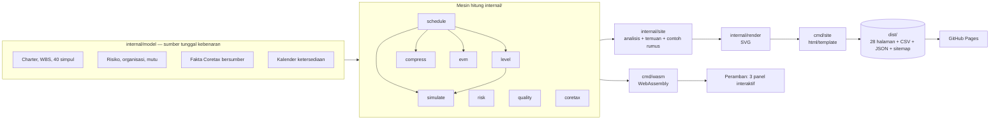

# Control Tower MPPL

**Ruang kendali kuantitatif untuk proyek perangkat lunak, ditulis dalam Go.**
Satu basis kode yang sama merender situs statis di server *dan* berjalan di peramban lewat WebAssembly.

[](https://github.com/xyb3rpunq/mppl-control-tower/actions/workflows/ci.yml)
[](https://github.com/xyb3rpunq/mppl-control-tower/actions/workflows/pages.yml)

| | |
| --- | --- |
| **Situs live** | https://xyb3rpunq.github.io/mppl-control-tower/ |
| **Bahasa Inggris** | https://xyb3rpunq.github.io/mppl-control-tower/en/ |
| **Mata kuliah** | Manajemen Proyek Perangkat Lunak — Universitas Esa Unggul |
| **Proyek yang dianalisis** | Sistem Informasi Alumni & Tracer Study STIE Jayakusuma |
| **Studi kasus nasional** | Coretax DJP (Rp 1,34 triliun) |

---

## Daftar isi

1. [Masalah yang dipecahkan](#1-masalah-yang-dipecahkan)
2. [Temuan utama](#2-temuan-utama)
3. [Peta situs: 14 halaman × 2 bahasa](#3-peta-situs-14-halaman--2-bahasa)
4. [Mesin hitung](#4-mesin-hitung)
5. [Referensi 32 rumus](#5-referensi-32-rumus)
6. [Bedah kasus Coretax](#6-bedah-kasus-coretax)
7. [Interaktivitas lewat WebAssembly](#7-interaktivitas-lewat-webassembly)
8. [Data terbuka](#8-data-terbuka)
9. [Arsitektur](#9-arsitektur)
10. [Menjalankan secara lokal](#10-menjalankan-secara-lokal)
11. [Pengujian](#11-pengujian)
12. [CI/CD](#12-cicd)
13. [Asumsi dan celah yang belum tertutup](#13-asumsi-dan-celah-yang-belum-tertutup)
14. [Sumber data](#14-sumber-data)

---

## 1. Masalah yang dipecahkan

Proyek perangkat lunak di Indonesia rutin gagal pada jadwal dan biaya, dan nyaris tidak ada yang menjalankan hitungan yang sebenarnya sudah bisa memperingatkan sejak awal. Perkakas yang mampu melakukannya — MS Project, Primavera — berbayar, tertutup, dan tidak berbahasa Indonesia.

Aplikasi ini menjalankan seluruh hitungan itu sebagai kode Go yang terbuka dan teruji:

- **Penjadwalan** — CPM empat relasi PDM, PERT, penjadwalan berbatas sumber daya, crashing, fast-tracking
- **Ketidakpastian** — Monte Carlo 10.000 iterasi dengan korelasi antar-aktivitas, kejadian risiko, dan kapasitas nyata
- **Biaya** — Earned Value lengkap sampai Earned Schedule, struktur anggaran berlapis, Joint Confidence Level
- **Risiko** — Expected Monetary Value inheren dan residual, uji kecukupan cadangan
- **Mutu** — Seven Basic Tools of Quality beserta aturan keputusannya

Lalu membuktikannya pada satu kasus nyata berskala nasional: **proyek Coretax DJP** senilai Rp 1,34 triliun, yang diluncurkan serentak untuk seluruh wajib pajak Indonesia pada 1 Januari 2025 dan dalam bulan pertama menurunkan penerimaan perpajakan sebesar 34,5%. Pola kegagalannya identik dengan proyek kuliah Rp 14,8 juta yang dianalisis situs ini — hanya skalanya yang berbeda sekitar sembilan puluh ribu kali.

---

## 2. Temuan utama

Semua temuan **diturunkan dari angka, bukan ditulis tetap**. Setiap temuan menyebut metrik pemicunya, dan kalau datanya diperbaiki, temuannya ikut hilang dengan sendirinya.

| # | Keparahan | Temuan | Angka |
| --- | --- | --- | --- |
| 1 | kritis | Proyeksi biaya akhir melewati pagu | EAC Rp 16.157.314 vs pagu Rp 16.000.000 (CPI 0,918) |
| 2 | kritis | Cadangan kontinjensi jauh di bawah paparan risiko | Cadangan Rp 500.000 menutup 17,4% dari EMV residual Rp 2.880.000 |
| 3 | kritis | Komitmen 17 minggu nyaris mustahil | Peluang selesai ≤ 85 hari kerja: 1,17%; P80 = 98 hari kerja |
| 4 | kritis | Jadwal 85 hari hanya sah di atas kertas | Setelah levelling sumber daya: **108 hari kerja**, selesai 25 Maret 2026 |
| 5 | kritis | Peluang tepat waktu *dan* tepat anggaran nyaris nol | JCL pada target piagam: 0,00%; komitmen JCL 70% = **135 hari kerja & Rp 21.399.000** |
| 6 | tinggi | Satu orang dijadwalkan pada dua pekerjaan sekaligus | 26 hari-peran over-alokasi; peran kritis: Backend Developer |
| 7 | tinggi | Waktu respons bergeser sistematis | 10 pelanggaran aturan Nelson walau semua nilai di bawah spesifikasi 3 detik |
| 8 | tinggi | Proyek tertinggal dalam satuan waktu | Earned Schedule: SV(t) = −2,90 hari kerja |
| 9 | sedang | Biaya kegagalan melebihi biaya pencegahan | Rasio kesesuaian/ketidaksesuaian 0,687 |
| 10 | sedang | Mengabaikan korelasi menyembunyikan ketidakpastian | Simpangan baku durasi melebar 23,1% dengan ρ = 0,5 |

Satu temuan tambahan dari halaman Piagam: **tanggal selesai di Project Charter salah lima hari kerja.** Tujuh belas minggu kalender polos berakhir 13 Februari 2026; 85 hari kerja sesungguhnya berakhir 20 Februari 2026 setelah akhir pekan dan lima hari libur dikeluarkan.

---

## 3. Peta situs: 14 halaman × 2 bahasa

Setiap halaman tersedia dalam bahasa Indonesia (akar situs) dan bahasa Inggris (`/en/…`), dengan tautan `hreflang` yang saling menunjuk. Total 28 halaman.

### 3.1 Ruang Kendali — `/`

- **Delapan KPI** dengan warna status: SPI, CPI, EAC, peluang tepat waktu, cakupan cadangan risiko, SV(t), durasi yang bisa dijalankan, dan JCL.
- **Kurva-S Earned Value**: PV, EV, AC, proyeksi biaya sampai akhir (mengikuti bentuk sisa kurva PV, bukan garis lurus), garis BAC, dan garis tanggal data.
- **Sepuluh temuan** diturunkan dari ambang, masing-masing dengan metrik pemicu, rekomendasi, dan tautan ke halaman perhitungannya.
- Ringkasan jadwal (termasuk selisih akibat hari libur) dan ringkasan anggaran berlapis.

### 3.2 Piagam & Lingkup — `/piagam/`

- Project Charter terstruktur: informasi umum, tujuan, lingkup masuk dan keluar, deliverable, asumsi, batasan.
- **Catatan pemeriksaan** yang membuktikan tanggal selesai piagam tidak konsisten dengan kalender kerja, lengkap dengan tabel hari libur yang ditandai *tetap* atau *asumsi*.
- Kriteria keberhasilan dengan status menurut data (anggaran dan jadwal terancam; sisanya belum terukur sebelum go-live).
- **Work Breakdown Structure** 5 fase → 15 paket kerja → 35 aktivitas + 5 milestone, dengan estimasi tiga titik, anggaran, float, dan pendahulu per aktivitas.
- **Pemeriksaan aturan 100%** secara aritmetis (jumlah anggaran aktivitas = BAC).
- **Rekonsiliasi anggaran**: grafik air terjun BAC → cadangan kontinjensi → cadangan manajemen → pagu Rp 16 juta, plus tabel tarif harian per peran.

### 3.3 Jadwal & Jalur Kritis — `/jadwal/`

- **Gantt chart** dengan batang jalur kritis, batang float (bayangan), batang realisasi (hijau/jingga bila melampaui rencana), penanda milestone, panah ketergantungan jalur kritis, dan garis tanggal data.
- **Diagram jaringan Activity-on-Node** dengan tata letak berlapis menurut early start; setiap simpul memuat ES, durasi, EF, LS, total float, LF.
- **Tabel CPM lengkap** 40 simpul: d, ES, EF, LS, LF, TF, FF, tanggal mulai/selesai, pendahulu.
- Rantai jalur kritis tersambung (29 simpul) dan tabel aktivitas ber-float terbesar beserta maknanya.

### 3.4 Levelling & Kompresi — `/optimasi/` *(baru)*

- **Levelling sumber daya** dengan Serial Schedule Generation Scheme: CPM 85 → kapasitas nyata 102 → periode ujian 108 hari kerja.
- **Kalender ketersediaan** per peran: Ujian Akhir Semester (kapasitas 40%, ditandai asumsi, memodelkan risiko R08) dan DevOps paruh waktu (dari piagam).
- **Gantt pembanding** CPM vs levelling, batang diwarnai menurut penyebab (terbawa pendahulu, menunggu orang, paruh waktu, periode ujian), dengan jendela ujian diarsir.
- **Histogram pembebanan setelah levelling** dengan garis kapasitas bertangga per hari — nol over-alokasi.
- Hari menunggu per peran dan identifikasi **peran kritis** (Backend Developer, 14 hari tunggu).
- Tabel aktivitas yang bergeser: geser, terbawa, menunggu, memanjang, penyebab.
- **Crashing**: kurva waktu-biaya 85 → 63 hari seharga Rp 1.215.375; lima hari pertama Rp 176.250; langkah yang memotong jalur kritis paralel ditandai; tabel batas crash per aktivitas dan alasan empat aktivitas yang tidak bisa dipercepat dengan uang.
- **Fast-tracking**: 23 kandidat diuji dengan tumpang tindih 50%; kandidat yang pendahulu dan penerusnya dikerjakan orang yang sama **ditolak**; 11 kandidat layak; penerapan serentak memberi 66 hari (penghematan tidak bisa dijumlahkan).

### 3.5 PERT & Monte Carlo — `/pert/`

- Perbandingan PERT (Z-score jalur kritis) dan Monte Carlo 10.000 iterasi berdampingan.
- Penjelasan **merge bias**: mengapa rerata simulasi 94,3 hari, bukan 85.
- Histogram durasi dengan kurva kumulatif dan penanda rencana, P50, P80, P90.
- Tabel tingkat keyakinan P50–P95 beserta tanggal selesai dan kelayakan untuk dijanjikan.
- **Diagram tornado** sensitivitas (korelasi peringkat Spearman) dan porsi iterasi kritis per aktivitas.
- Tabel estimasi tiga titik: O, M, P, te, σ, varians, dan kecondongan.
- **Panel WebAssembly**: jalankan ulang Monte Carlo dengan iterasi, benih, dan sebaran (beta-PERT/segitiga) pilihan.

### 3.6 Simulasi Terpadu & JCL — `/simulasi-terpadu/` *(baru)*

- **Empat lapisan realisme** dengan benih yang sama sehingga selisihnya murni efek yang ditambahkan:

  | Lapisan | Efek | P80 durasi | P80 biaya | JCL |
  | --- | --- | --- | --- | --- |
  | L0 | Independen (identik dengan halaman PERT) | 98 | Rp 15,93 jt | 1,17% |
  | L1 | + Korelasi peran (kopula Gauss, ρ 0,5) | 99 | Rp 16,01 jt | 3,45% |
  | L2 | + Kejadian risiko dari register | 116 | Rp 19,94 jt | 0,16% |
  | L3 | + Kapasitas & periode ujian (levelling per iterasi) | 139 | Rp 19,94 jt | 0,00% |

- **Tangga realisme** durasi dan biaya (P50–P90 dengan penanda P80 dan garis target piagam).
- Penjelasan mengapa biaya lapisan independen pun sudah di atas BAC (kecondongan estimasi tiga titik).
- **Peta kepadatan JCL** (histogram 2D durasi × biaya) dengan **frontier JCL 70%**, silang target piagam, dan titik P80 × P80.
- Tabel frontier tenggat → anggaran minimum, dan histogram biaya akhir dengan penanda pagu, P50, P80.
- **Uji kepekaan ρ** (0; 0,25; 0,5; 0,75) dengan korelasi terealisasi sebagai bukti model kopula bekerja.
- Frekuensi kejadian setiap risiko dalam simulasi terhadap peluang residualnya.
- **Panel WebAssembly**: geser ρ, pilih lapisan, jalankan simulasi terpadu di peramban.

### 3.7 Biaya & Earned Value — `/biaya/`

- KPI PV, EV, AC, BAC.
- **Tabel seluruh metrik turunan** dengan rumus dan kalimat cara membaca: SV, CV, SPI, CPI, ES, SV(t), SPI(t), tiga varian EAC, ETC, VAC, TCPI.
- **Panel WebAssembly** untuk menggeser tanggal data (dibatasi pada hari terakhir yang punya realisasi, agar SPI yang anjlok karena kehabisan data tidak terbaca sebagai temuan).
- Kurva-S, grafik anggaran berlapis, dan catatan bahwa proyeksi menembus seluruh cadangan.
- Earned Value per fase dan per aktivitas (% rencana, % aktual, EV, AC, CV, status).

### 3.8 Manajemen Risiko — `/risiko/`

- KPI EMV inheren, EMV residual, cadangan tersedia, kekurangan cadangan dan paparan jadwal.
- **Dua peta panas 5×5** — sebelum dan sesudah mitigasi.
- **Risk register 12 entri**, masing-masing dengan kategori, pemilik, WBS terpapar, sebab, akibat, peluang/dampak/EMV/skor inheren dan residual, persentase penurunan EMV, strategi respons, mitigasi, dan pemicu.
- Paparan per kategori dan rekomendasi soal kecukupan cadangan.

### 3.9 Organisasi & Sumber Daya — `/organisasi/`

- **Bagan organisasi** lima tingkat (sponsor → PM → core lead → tim pelaksana) dan kartu tanggung jawab tiap peran.
- **Matriks RACI** per fase WBS yang divalidasi uji (tepat satu A per baris).
- **Histogram pembebanan** 10 peran sepanjang 85 hari kerja dengan batang over-alokasi merah, tabel utilisasi, dan daftar bentrokan terberat.
- **Grid kuasa-kepentingan** 10 pemangku kepentingan dan **rencana komunikasi** enam jalur.

### 3.10 Manajemen Mutu — `/kualitas/`

- **Tujuh metrik mutu** terukur terhadap target standar Project Charter.
- **Peta kendali X-bar** waktu respons: CL, UCL, LCL (metode A2·R̄), batas spesifikasi, σ proses, Cpk, dan penanda pelanggaran **empat aturan Nelson**.
- **Diagram Pareto** cacat berbobot keparahan (kritis 5, mayor 3, minor 1) per modul.
- **Dua diagram fishbone** (6M) dengan akar penyebab.
- **Biaya kualitas** empat kategori, rincian pos (terjadi vs proyeksi), dan rasio kesesuaian/ketidaksesuaian.

### 3.11 Bedah Kasus: Coretax — `/coretax/`

Lihat [bagian 6](#6-bedah-kasus-coretax).

### 3.12 Referensi Rumus — `/rumus/`

32 rumus dalam enam kelompok. Setiap rumus memuat notasi (dwibahasa), arti tiap simbol, makna, cara membaca, **jebakan umum**, rujukan materi, dan **contoh hitung yang disuntik dari angka hidup** — jadi halaman rumus tidak pernah bisa berbeda dari halaman analisisnya. Lihat [bagian 5](#5-referensi-32-rumus).

### 3.13 Materi & Area Pengetahuan — `/materi/`

- **Sembilan area pengetahuan** (Modul 2) dengan tautan ke artefak yang membuktikan area itu benar-benar dikerjakan, plus catatan area kesepuluh PMBOK 5.
- **Empat tahap siklus hidup** (Tugas 3) dipetakan ke fase WBS.
- **Peta materi kuliah → paket kode** yang mengimplementasikannya.
- Daftar dokumen sumber di folder mata kuliah, termasuk satu berkas yang tidak terkait (dokumen Oracle OLVM).

### 3.14 Metode & Sumber — `/metode/`

Arsitektur paket, keputusan teknis, **tabel asumsi** (alasan dan akibatnya bila keliru), **celah yang belum tertutup**, dan tautan data terbuka.

---

## 4. Mesin hitung

Seluruh perhitungan berada di `internal/` sebagai paket Go murni **tanpa satu pun dependensi pihak ketiga**.

### `workcal` — kalender kerja
Pemetaan dua arah indeks hari kerja ↔ tanggal, lima hari libur (ditandai tetap/asumsi), indeks pecahan untuk tanggal data yang jatuh di akhir pekan, dan daftar libur di dalam rentang.

### `schedule` — CPM dan PERT
- Urutan topologis dengan deteksi siklus, predecessor tak dikenal, dan kode ganda.
- Forward pass dan backward pass untuk **FS, SS, FF, SF** dengan lag dan lead.
- Total float, free float, dan **rantai kritis tersambung** (bukan sekadar filter float nol).
- PERT: te, σ, varians, varians jalur kritis, Z-score, dan peluang selesai.
- Konvensi batas inklusif untuk tampilan dan eksklusif untuk aritmetika, sehingga milestone berdurasi nol tidak butuh kasus khusus.

### `level` — penjadwalan berbatas sumber daya *(baru)*
- **Serial Schedule Generation Scheme** dengan aturan prioritas minimum latest start.
- **Model isi pekerjaan**: laju harian = min(1, sisa kapasitas / alokasi) atas semua peran; hari-orang dilestarikan, kalender yang memanjang.
- Kapasitas per peran per hari dari `model.AvailabilityWindows` (jendela bertumpuk dikalikan).
- Pemecahan keterlambatan per aktivitas: **terbawa**, **menunggu**, **memanjang**, beserta penyebab (paruh waktu, jendela ketersediaan, berbagi orang).
- `Explain`: dekomposisi bertahap CPM → kapasitas → jendela.
- Mode `Lite` dan `CapacityGrid` yang dihitung sekali untuk dipakai ribuan kali di simulasi (hasil identik, diuji).

### `compress` — kompresi jadwal *(baru)*
- **Crashing** serakah per hari: kandidat tunggal, lalu pasangan, lalu tiga aktivitas sekaligus bila ada jalur kritis paralel; setiap langkah diverifikasi ulang dengan CPM.
- Batas crash per aktivitas dengan satu aturan untuk semua dan daftar aktivitas yang tidak bisa dipercepat dengan uang beserta alasannya.
- **Fast-tracking**: setiap relasi FS kritis diganti SS dengan tumpang tindih 50%; rework harapan; **penolakan kandidat orang-sama**; penerapan gabungan untuk menunjukkan penghematan tidak aditif.

### `evm` — Earned Value
PV/EV/AC dengan kemajuan linear dalam aktivitas; SV, CV, SPI, CPI; **Earned Schedule** (pencarian biner pada kurva PV) dengan SV(t) dan SPI(t); tiga varian EAC; ETC; VAC; TCPI; kurva-S dan proyeksi biaya; rincian per fase dan per aktivitas.

### `simulate` — Monte Carlo
- PRNG **mulberry32 berbenih** — hasil identik di server dan WebAssembly.
- **Sampler bersama** lewat transformasi invers: beta-PERT baku (α = 1 + 4(M−O)/(P−O)), CDF dari **fungsi beta tak lengkap teregularisasi** (pecahan berlanjut Lentz) ditabulasi pada 2.049 titik; sebaran segitiga dengan invers tertutup.
- **Kopula Gauss** per peran dominan: u = Φ(ρ·z_peran + √(1−ρ²)·ε).
- Simulasi PERT: histogram, kuantil, peluang, sensitivitas Spearman, porsi kritis.
- **Simulasi terpadu** empat lapisan dengan biaya per iterasi, kejadian risiko Bernoulli, levelling per iterasi, **Joint Confidence Level**, frontier iso-JCL, histogram 2D, dan korelasi terealisasi.

### `risk` — risiko kuantitatif
Tingkat peluang dan dampak (relatif terhadap BAC), skor dan keparahan, matriks inheren dan residual, EMV, penurunan EMV per risiko, agregasi kategori, cakupan dan kekurangan cadangan, paparan jadwal harapan.

### `resource` — pembebanan
Beban harian per peran, deteksi over-alokasi dengan daftar aktivitas penyebab, utilisasi, jumlah peran aktif per hari, dan kehalusan kurva tim.

### `quality` — pengendalian mutu
Pareto berbobot dengan kelompok *vital few*; peta kendali X-bar dengan konstanta A2/d2; empat aturan Nelson yang **diuji terhadap batas yang sama dengan yang digambar**; Cpk satu sisi; biaya kualitas; evaluasi metrik dua arah.

### `coretax` — studi kasus
Metrik turunan dari fakta bersumber, empat skenario transisi dengan EMV, titik impas peluang kegagalan, dan tabel cermin Coretax ↔ proyek kuliah.

### `render` — grafik SVG
Pembangun kanvas SVG dan 22 jenis grafik, semuanya dengan `<title>` dan `<desc>` untuk pembaca layar, warna lewat kelas CSS (tema gelap tanpa gambar ulang), dan escape teks.

### `site`, `model`, `i18n`
Perakit analisis dan penurun temuan; sumber tunggal kebenaran seluruh data proyek; kamus antarmuka dwibahasa.

---

## 5. Referensi 32 rumus

| Kelompok | Rumus |
| --- | --- |
| **Penjadwalan & Jalur Kritis** | Early Finish (forward pass) · Late Start (backward pass) · Total & free float |
| **Estimasi Tiga Titik & PERT** | Durasi harapan te · Simpangan baku & varians · Peluang Z · Simulasi Monte Carlo · Sensitivitas Spearman · **Sebaran beta-PERT & transformasi invers** |
| **Earned Value Management** | PV/EV/AC · SV & CV · SPI & CPI · Tiga varian EAC · TCPI · Earned Schedule |
| **Risiko Kuantitatif** | EMV · Skor & matriks probabilitas-dampak · Struktur anggaran berlapis |
| **Pengendalian Mutu** | Batas kendali X-bar · Aturan Nelson · Cpk · Biaya kualitas · Analisis Pareto |
| **Sumber Daya** | Pembebanan & utilisasi · Kehalusan kurva tim |
| **Levelling & Kompresi Jadwal** | **Serial Schedule Generation Scheme · Laju kerja berbatas kapasitas · Crashing & slope biaya · Fast-tracking & rework harapan** |
| **Simulasi Terpadu & JCL** | **Korelasi lewat kopula Gauss · Kejadian risiko dalam simulasi · Joint Confidence Level** |

Rumus bercetak tebal ditambahkan pada upgrade terakhir. Setiap rumus di atas punya contoh hitung dari data hidup — uji `TestEveryFormulaHasAWorkedExample` gagal bila ada yang tidak.

---

## 6. Bedah kasus Coretax

Halaman ini memakai **tiga lapis kejujuran** yang dijaga uji:

| Lapis | Aturan | Contoh |
| --- | --- | --- |
| **Fakta** | Setiap angka punya URL sumber publik | Kontrak LG CNS–Qualysoft Rp 1,228 T; Owner's Agent Rp 110,3 M; go-live 1 Jan 2025; penerimaan Januari turun 34,5%; potensi hilang Rp 64 T |
| **Turunan** | Aritmetika murni atas fakta, rumus ditampilkan | Rasio paparan **47,8×** biaya proyek; seluruh biaya proyek setara 0,65 hari kerugian penerimaan |
| **Skenario** | Andaian, diberi label bukan fakta | Empat strategi transisi dibandingkan dengan EMV; jalan paralel impas pada peluang gagal cutover 0,279% |

Isi halaman: 14 kartu fakta bersumber, linimasa 2018–2026, tabel metrik turunan, perbandingan empat strategi transisi (serentak, paralel, bertahap, pilot) dengan grafik biaya harapan, titik impas, **enam pelajaran yang dipetakan ke praktik MPPL dan ke gejala yang sama pada proyek kuliah**, dan daftar 11 sumber (Kompas, Tempo, Hukumonline, DDTC News, Beritasatu, Direktorat Jenderal Pajak).

---

## 7. Interaktivitas lewat WebAssembly

`cmd/wasm` mengompilasi paket `internal/` yang sama ke WebAssembly. Tidak ada rumus yang ditulis dua kali, jadi tidak mungkin ada versi JavaScript yang diam-diam berbeda dari versi Go. Terverifikasi: simulasi terpadu L3 10.000 iterasi di peramban menghasilkan P80 139 dan biaya P80 Rp 19.937.000 — identik dengan hasil server.

| Halaman | Fungsi Go | Kendali |
| --- | --- | --- |
| Biaya | `mpplRecompute(tanggal)` | Geser tanggal data → SPI, CPI, SV(t), EV, AC, EAC, VAC, TCPI, % selesai |
| PERT | `mpplSimulate(iterasi, benih, sebaran)` | Monte Carlo ulang + histogram |
| Simulasi Terpadu | `mpplIntegrated(iterasi, benih, ρ, lapisan)` | Slider ρ, pilihan lapisan L0–L3 → JCL, peluang, P80, korelasi terealisasi + histogram |

Bila WebAssembly gagal dimuat, panel tetap tersembunyi dan halaman menampilkan angka yang benar untuk tanggal data bawaan — seluruh isi dan grafik sudah dirender server.

---

## 8. Data terbuka

| Berkas | Isi |
| --- | --- |
| [`data/metrik.json`](https://xyb3rpunq.github.io/mppl-control-tower/data/metrik.json) | Earned Value, anggaran berlapis, simulasi PERT, risiko, mutu, **levelling, kompresi, dan simulasi terpadu per lapisan** |
| [`data/aktivitas.csv`](https://xyb3rpunq.github.io/mppl-control-tower/data/aktivitas.csv) | 40 simpul: WBS, durasi, ES, EF, LS, LF, float, kritis, **mulai/selesai/geser levelling**, anggaran, PV, EV, AC |
| [`data/risiko.csv`](https://xyb3rpunq.github.io/mppl-control-tower/data/risiko.csv) | 12 risiko: peluang, dampak, EMV inheren dan residual, skor, keparahan, respons, pemilik, status |
| [`sitemap.xml`](https://xyb3rpunq.github.io/mppl-control-tower/sitemap.xml) | 28 URL dengan pasangan `hreflang` |

---

## 9. Arsitektur



Keputusan teknis penting:

- **Grafik dirender di server** sebagai SVG inline. Halaman utuh tanpa JavaScript, bisa dicetak jadi PDF, terbaca mesin pengindeks, tanpa kedipan saat muat.
- **Semua perhitungan dijalankan sekali** per build dan dibagikan ke semua halaman, sehingga halaman biaya dan halaman risiko tidak mungkin melihat BAC yang berbeda.
- **Benih acak tetap.** Tanpa itu angka dasbor bergoyang setiap build dan mustahil diverifikasi.
- **Nol dependensi.** Setiap angka bisa ditelusuri sampai ke barisnya.
- **PWA luring**: service worker di akar situs (cache-first untuk aset, network-first untuk halaman) dan manifest.

Ukuran kode: sekitar 10.650 baris Go aplikasi, 3.150 baris Go uji, 2.080 baris templat, 750 baris CSS.

---

## 10. Menjalankan secara lokal

Butuh Go 1.24 atau lebih baru.

```bash
go test ./...
```

```bash
GOOS=js GOARCH=wasm go build -o web/static/js/mppl.wasm ./cmd/wasm
```

```bash
cp "$(go env GOROOT)/lib/wasm/wasm_exec.js" web/static/js/
```

```bash
go run ./cmd/site -out dist -base ""
```

```bash
cd dist && python -m http.server 8231
```

Buka http://127.0.0.1:8231. Bendera generator:

| Bendera | Bawaan | Fungsi |
| --- | --- | --- |
| `-out` | `dist` | Direktori keluaran |
| `-base` | kosong | URL dasar untuk tautan kanonis, `hreflang`, sitemap |
| `-status` | `2025-12-19` | Tanggal data pelaporan Earned Value |

---

## 11. Pengujian

**145 fungsi uji di 12 paket.** Sebagian besar tidak sekadar memeriksa fungsi berjalan, tetapi **menjaga klaim yang ditampilkan situs tetap benar**:

**Penjadwalan**
- Durasi jaringan harus 85 hari kerja = 17 minggu piagam.
- Uji tangan forward/backward pass pada jaringan kecil, keempat relasi PDM, lag dan lead.
- Jalur kritis harus benar-benar tersambung; free float tidak boleh melebihi total float.
- Siklus, predecessor tak dikenal, dan kode ganda harus ditolak.

**Levelling dan kompresi**
- Tidak ada satu hari-peran pun melebihi kapasitas setelah levelling.
- **Hari-orang dilestarikan** — levelling menggeser pekerjaan, tidak menambah atau menghilangkannya.
- Setiap relasi tetap dihormati; pemecahan terbawa + menunggu harus menjumlah.
- Mode `Lite` harus menghasilkan jadwal identik dengan mode lengkap.
- Setiap langkah crashing diverifikasi ulang dengan CPM; tidak ada hari yang "dibeli" tanpa memendekkan proyek.
- Jalur kritis paralel harus dipotong berpasangan; aktivitas terlarang tidak pernah di-crash.
- Kandidat fast-tracking orang-sama tidak boleh dianggap layak; penghematan gabungan tidak boleh melebihi jumlah naif.

**Simulasi**
- Benih sama → hasil identik; benih berbeda → kesimpulan stabil.
- **Lapisan L0 harus identik persis dengan halaman PERT.**
- ρ = 0 memberi korelasi terealisasi mendekati nol; ρ = 0,8 menaikkannya dan melebarkan sebaran.
- Setiap lapisan realisme menggeser P80 ke arah yang benar; JCL tidak pernah melebihi peluang marginal; peluang bersama di P80×P80 selalu di bawah 80%.
- Frekuensi kejadian risiko cocok dengan peluang residual; frontier JCL tidak naik saat tenggat dilonggarkan.
- **Kenaikan rerata biaya dari L1 ke L2 harus mendekati EMV residual register** (pemeriksaan silang antar-halaman).
- Nilai-nilai I_x(a,b) terhadap solusi tertutup; rerata beta-PERT sama dengan te.

**Anggaran, risiko, mutu**
- BAC + kontinjensi + cadangan manajemen = Rp 16.000.000 persis; aturan 100% WBS dua arah.
- Tepat satu Accountable per baris RACI.
- Titik di luar UCL harus terdeteksi aturan 1 (batas yang digambar = batas yang diuji).

**Render dan konten**
- Seluruh 28 halaman dirender tanpa galat, tanpa sisa sintaks templat, tanpa kunci terjemahan hilang.
- **Halaman Inggris tidak boleh memuat kata fungsi Indonesia** — uji ini merender HTML sungguhan lalu memindainya, dan menemukan bocoran nyata (label status, notasi rumus, nilai fakta, metrik temuan) yang lolos dari pemeriksaan kelengkapan kamus.
- Tidak ada singkatan bulan Indonesia di dalam kalimat Inggris.
- Angka kunci — termasuk angka halaman baru — harus benar-benar sampai ke HTML, diformat dari struct analisis, bukan diketik.
- Setiap fakta Coretax punya URL sumber yang tertaut di HTML dengan `rel="noopener"`.
- Setiap SVG utuh, beraksesibilitas, bebas NaN, tanpa warna heksadesimal langsung.
- Setiap rumus punya contoh hitung dalam kedua bahasa.

---

## 12. CI/CD

Dua alur kerja GitHub Actions:

**`uji`** — setiap push dan pull request: `gofmt`, `go vet`, `go test -race`, laporan cakupan, kompilasi WebAssembly, build situs, dan pemeriksaan keluaran (28 halaman, sitemap, service worker, metrik).

**`terbitkan`** — setiap push ke `main`: uji ulang, kompilasi WebAssembly, `configure-pages` (dijalankan **sebelum** build agar URL dasar benar), build situs, lalu penerbitan ke GitHub Pages.

---

## 13. Asumsi dan celah yang belum tertutup

**Asumsi** (seluruhnya dinyatakan juga di halaman Metode):

| Asumsi | Akibat bila keliru |
| --- | --- |
| Kemajuan linear dalam aktivitas | Aturan 0/100 atau 50/50 memberi EV berbeda |
| Data realisasi SIATS adalah skenario pelaksanaan yang wajar (proyek kuliah tidak dieksekusi) | Angka EV berubah; rumus dan cara membaca tidak |
| Tiga dari lima hari libur ditandai asumsi | Setiap libur yang meleset menggeser selesai satu hari kerja |
| Korelasi peran ρ = 0,5 | P80 hanya bergeser satu hari; lebar sebaran yang berubah |
| Periode ujian 12–23 Jan 2026 dengan kapasitas 40% | Tanpa jendela ini levelling masih 102 hari kerja |
| Premi crash 75%, peluang rework 30% | Biaya berubah sebanding, urutan potongan tidak |
| Peluang gagal cutover Coretax 35% (skenario) | Titik impasnya 0,279% — kesimpulan bertahan |

**Celah yang belum tertutup:**

1. **Levelling adalah heuristik** — SGS memberi jadwal yang bisa dijalankan, bukan jaminan jadwal terpendek (RCPSP adalah NP-hard).
2. **Kejadian risiko saling bebas** — dan tidak berkorelasi dengan durasi aktivitas; ekor kanan simulasi masih terlalu tipis.
3. **Biaya tidak punya komponen yang bergantung waktu** — proyek yang molor tidak dikenai biaya hosting atau koordinasi tambahan.
4. **Simulasi berpandangan perencanaan** — belum dimulai dari realisasi pada tanggal data.
5. **Tidak ada pengulangan kerja (GERT)** — rework hanya muncul sebagai biaya dan hari, bukan putaran di jaringan.

Versi sebelumnya mencantumkan empat celah lain — korelasi durasi, penjadwalan berbatas sumber daya, simulasi biaya, dan kalender per peran — yang kini sudah dikerjakan.

---

## 14. Sumber data

**Proyek SIATS** — tugas mata kuliah Manajemen Proyek Perangkat Lunak, Universitas Esa Unggul: Tugas 2 (9 area pengetahuan), Tugas 3 (siklus hidup), Tugas 5 (uraian peran), Tugas 6 (Project Charter & WBS), Tugas 10 (bagan organisasi & RACI); serta materi Modul 2, Modul 4, Pertemuan 3, Pertemuan 7 (MS Project), dan Pertemuan 9 (manajemen mutu, Schwalbe bab 8).

**Studi kasus Coretax** — pemberitaan publik Kompas, Tempo, Hukumonline, DDTC News, Beritasatu, dan keterangan resmi Direktorat Jenderal Pajak; daftar lengkap dengan tanggal ada di [halaman studi kasus](https://xyb3rpunq.github.io/mppl-control-tower/coretax/).

**Metode** — PMBOK; Kolisch (1996) untuk SGS; Lipke (2003) untuk Earned Schedule; Nelson (1984) untuk aturan peta kendali; Vose (2008) untuk beta-PERT; Numerical Recipes untuk fungsi beta tak lengkap; NASA Cost Estimating Handbook untuk JCL 70%.

Situs ini tidak berafiliasi dengan Direktorat Jenderal Pajak maupun pihak mana pun yang disebut. Analisisnya adalah kerja akademik.

## Lisensi

MIT.
